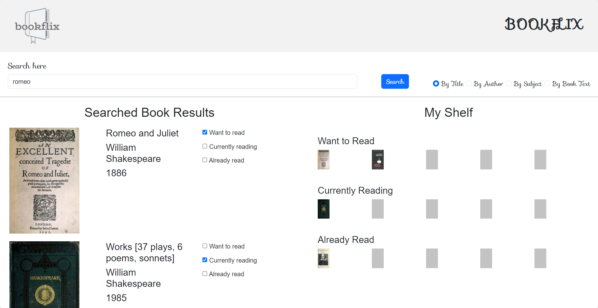

# Bookflix

## Overview

Bookflix is a feature-rich book reader planner designed to help you organize, track, and enhance your reading experience. With the ability to create different lists, mark books as 'Read,' and receive genre-specific recommendations, Bookflix makes managing your book collection a seamless and enjoyable process.



## Getting Started

### Tech Stack

- JavaScript
- jQuery
- Bootstrap

### Public API

Bookflix utilizes the following API:

- [Open Library API](https://openlibrary.org/developers/api) for general book information.

### Installation

1. Clone the repository
    ```console
    git clone https://github.com/borregaio/bookflix.git
    ```

2. Open the index.html file in a web browser
    ```console
    cd bookflix
    open index.html
    ```

### Deployment

The deployed version can be accessed [here](https://borregaio.github.io/bookflix/).

## Key Features
1. Search and Add Books:
    - Utilise the Open Library API to search for books by title, author, or other criteria.
    - Add books to different lists: "Want to Read," "Currently Reading," and "Read."
2. Organise Your Lists:
    - View and manage your lists with ease.
    - Cross off books as you complete them, automatically moving them to the "Read" list.
3. Recommendations:
    - Receive recommendations based on specific genres of books you are interested in.

## Steps Followed

- Utilise the Open Library API to search for books by title, author, or other criteria.
    ```javascript
    const buildReturnObject = (data) =>{
    let results = null;

    const books = data.docs;
    results = books.map((obj) => {
        let bookImgURL ;
        if(obj.hasOwnProperty("cover_edition_key"))
        {
            bookImgURL = `https://covers.openlibrary.org/b/olid/${obj.cover_edition_key}-M.jpg`;
        }else{
            bookImgURL = "./assets/images/No_Image_Available.jpg";
        }
        return {
            imgURL: bookImgURL,
            bookTitle: obj.title,
            authorName: obj.author_name[0],
            yearPublished: obj.publish_year[0]
        }
    });

    return results;
    };
    ```

- Search bar with search options.
    ```html
    <div class="tick-box-options">
        <label class="form-check-label">
        <input type="radio" name="searchType" id="byTitle" class="form-check-input" value="byTitle" checked> By Title
        </label>
        <label class="form-check-label">
            <input type="radio" name="searchType" id="byAuthor" class="form-check-input" value="byAuthor"> By Author
        </label>
        <label class="form-check-label">
            <input type="radio" name="searchType" id="bySubject" class="form-check-input" value="bySubject"> By Subject
        </label>
        <label class="form-check-label">
            <input type="radio" name="searchType" id="byText" class="form-check-input" value="byText"> By Book Text
        </label>
    </div>
    ```

- A search section displaying the search results with a title, author, year published and cover.
    ```javascript
    function doSearchDisplay(resultArr) {

    var results = $('#results');
    results.empty();

    //Create Results Title
    var resultsTitle = $('<h2>').text('Searched Book Results');
    results.append(resultsTitle);

    // Create results row
    resultArr.forEach(element => {
        var row = $('<div>').addClass('row');
        var cover = $('<div>').addClass('cover col-sm-4');
        var information = $('<div>').addClass('information col-sm-4');
        var lists = $('<div>').addClass('lists col-sm-4');

        // Cover image
        var coverResult = $('').attr('src', element.imgURL).attr('width', 180);
        // coverResult.addClass('coverImg');
        cover.append(coverResult);

        // Book information
        var titleResult = $('<h4>').text(element.bookTitle);
        var authorResult = $('<h4>').text(element.authorName);
        var yearResult = $('<h4>').text(element.yearPublished);
        information.append(titleResult, authorResult, yearResult);

        // Clickable lists
        var listSelection = 3;
        var checkboxes = $('<ul>');
        lists.append(checkboxes);

        for (var j = 0; j < listSelection; j++) {
            //Create list/checkbox input
            var list = $('<li>');
            var input = $('<input>').attr('type', 'checkbox');
            list.append(input);

            //Add text to input
            var listsText = ['Want to read', 'Currently reading', 'Already read'];
            list.append(document.createTextNode(' ' + listsText[j]));

            //Append lists
            checkboxes.append(list);
        }

        row.append(cover, information, lists);
        results.append(row);
    });

    }
    ```

- Rows of lists to display the selected books.
    ```html
    <div class="row">
        <div class="recomendbox col">
            <h3>RECOMMEND</h3>
        </div>
        <div class="col">
            
        </div>
        <div class="col">
            
        </div>
        <div class="col">
            
        </div>
        <div class="col">
            
        </div>
    </div>
    ```

- Responsive styles.
    ```css
    @media (max-width: 768px) {

    .search-section {
        flex-direction: column;
        align-items: flex-start;
    }

    .search-box {
        width: 100%;
        margin-bottom: 10px;
    }

    .navbar h1 {
        font-size: 24px;
        margin-right: 0;
    }

    .navbar img {
        top: 5px;
        left: 5px;
        width: 100px;
    }

    .myShelf {
        width: 100%;
    }

    }
    ```

## Contributors

- Carlos Borrega
- Desire Anunobi
- Gjorgji Krstevski
- Mohammed Husain
- Sufyan Gajra
